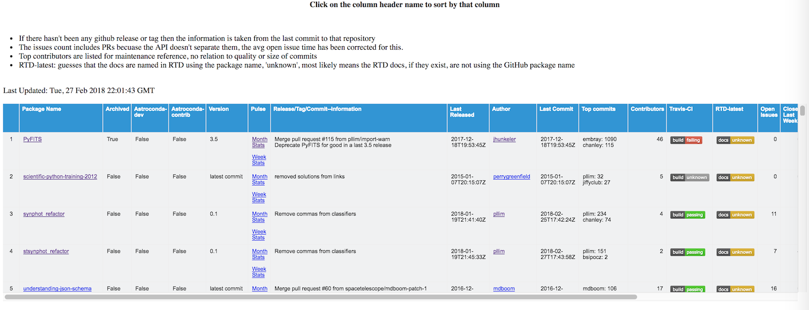

===================
Examples and Output
===================

The repostats module can be used as a library of functions to get a view into GitHub statistics about the repositories that live in a given organization. You can use the functions by themselves, or use some of the report generating functions which coallate everything into an organized report.

Generate an HTML page with a sortable table of results
------------------------------------------------------

`get_repo_info()` will return a list of dictionaries, one for each repository, with all of the
information returned by the GitHub API calls, in addition to some statistics calculated by the `get_statistics()` function. 

The output from `get_repo_info()` can be fed into make_summary_page() to generate the HTML report. 

The calls would look like this::

    data=repostats.get_repo_info('spacetelescope')
    repostats.make_summary_page(data, outpage='spacetelescope_public.html')

The output HTML page contains some general text at the top, information about when it was updated, and a large (wide) output table. Since there are many default columns, the table is set to a set size and it can be scrolled horizontally or vertically to show it's full contents, keeping the
header row and package name columns frozen for reference.

Save a json file of all the GitHub information
----------------------------------------------
It's possible to save the raw response list from `get_repo_info()` into a json file for later use:

`repostats.write_response_file(data=data, filename='spacetelescope_public.json')`

The file can later be read back into a structure using `read_response_file()`

Print a text report to the screen
---------------------------------
Once the data has been generated, `print_text_summary()` will print out a text summary for the stats dictionary that has been passed to it. This dictionary lives inside each of the repository dictionaries that were returned in the `get_repo_info()` list. 

For example, if you had saved a json file of all the spacetelescope repos::

    In [1]: import repostats

    In [2]: data=repostats.read_response_file('spacetelescope_public.json')
    
    In [3]: repostats.print_text_summary(data[4]['statistics'])

    Report for spacetelescope: understanding-json-schema
    Open issues:  16
    Closed issues this week:   0
    Closed issues this month:   1
    Commits in last week:   0
    Commits in last month:   0

    Open Pull Requests:   7

    Number Title                                       Created               Last Updated          
    67     Add CODE_OF_CONDUCT.md to repo              2018-01-26T22:23:21Z  2018-01-26T22:23:21Z  
    66     Update exclusive* keywords specification    2017-12-27T09:49:42Z  2017-12-27T18:04:29Z  
    65     Fix failing validation of example           2017-10-11T17:18:12Z  2017-10-30T12:01:05Z  
    63     Add sections to format RFC links            2017-05-29T17:43:47Z  2017-05-29T17:43:47Z  
    61     Lookahead                                   2017-01-18T14:37:09Z  2017-01-18T14:37:09Z  
    52     Use actual unicode for the unicode example  2016-05-31T15:32:16Z  2016-06-13T07:59:31Z  
    13     Ruby type equivalents                       2013-12-26T17:37:47Z  2016-10-23T19:48:26Z  

In order to look over all the repositories in the list, simply iterate::

    for repo in data:
        repostats.print_text_summary(repo['statistics'])

Get information for specific repositories
-----------------------------------------
If you know the repository names for which you'd like information, you can specify them directly::
    

       In [1]: repos = ['PyFITS', 'asdf', 'understanding-json-schema']

       In [2]: data = repostats.get_repo_info(org='spacetelescope', repos=repos)
    
       In [3]: repostats.make_summary_page(data, outpage='myrepos.html')

Get the statistics information for a single repository
------------------------------------------------------
You can use the `get_statistics()` to return a dictionary of the statistics information for a single repository; you can then do something with the results, or use `print_text_summary()` to
print a summary of the results to the terminal screen::

    In [1]: stats = repostats.get_statistics(org='spacetelescope', repos='understanding-json-schema')

Get a list of the software included with the astroconda distribution
--------------------------------------------------------------------
`get_astroconda_list()` will return a list of the names of the software included with the astroconda distribution::

    In [1]: astroconda = get_astroconda_list(flavor="contrib")

